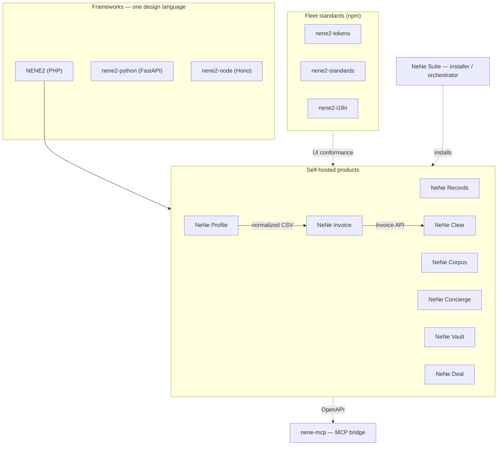

<!--
  HERO IMAGE SLOT (pending — ClaudeDesign via hub, AYANE "ENGINEERED/工" tokens: 墨/生成/朱).
  Target 1280×640, premium/quiet tone, light+dark. When delivered, drop the <picture> below
  in place of this comment:

  <picture>
    <source media="(prefers-color-scheme: dark)"  srcset="assets/hero-dark.png">
    <source media="(prefers-color-scheme: light)" srcset="assets/hero-light.png">
    
  </picture>
-->

# Hideyuki Mori

### Bank-grade engineering, at a fair and transparent price.

A full-stack engineer (25 years JavaScript · 20 years PHP) shipping a whole fleet of **self-hosted business tools** — one design language across PHP, Python, and Node, with **convention-visible JSON APIs** built for humans and AI agents alike. Built solo, with AI-driven development, held to the quality bar of enterprise core systems.

**→ Hire us / talk it through:** **[ayane.co.jp](https://ayane.co.jp/)**  ·  **→ Touch a live product in 30 seconds:** **[Invoice demo sandbox](https://invoice.ayane.co.jp/demo/kensetsu)** (no signup, auto-deletes)

---

## At a glance

Numbers below are **measured, not claimed** — each links to where you can check it yourself.

| | |
| --- | --- |
| **Live right now** | [Invoice demo](https://invoice.ayane.co.jp/demo/kensetsu) — a fresh disposable org per click · [nene-records.com](https://nene-records.com) — multi-tenant SaaS in production |
| **Scale** | **5,000+ merged PRs** across my own fleet · **32 public repos** ([verify](https://github.com/search?q=is%3Apr+is%3Amerged+author%3AhideyukiMORI+owner%3AhideyukiMORI&type=pullrequests)) |
| **Quality gates** | **PHPStan level 8** · `mypy --strict` · fleet-wide conformance linting · **JWT fail-closed by default** |
| **Test quality** | NeNe Records — **1,256 PHPUnit + 220 Playwright E2E** (measured, not self-reported) |
| **Languages** | PHP 8.4 · Python 3.14 · TypeScript — one OpenAPI-shaped architecture |

---

## Why hire this

The point of the fleet is not "look how much I built." It's the reason a small team can deliver **core-system-grade quality at a fair, transparent price**:

- **Battle-hardened.** 25 years JS / 20 years PHP as a working full-stack engineer. Most recently commissioned on a **regional bank core-system cloud migration** — the kind of work where "it must not fall over" is the baseline, not a stretch goal.
- **AI-driven delivery.** I established a spec → AI-implementation workflow in enterprise work, then applied it across my own 14-repo fleet. That's how one engineer ships and maintains this much without cutting quality.
- **Everything is out in the open.** The code, the tests, the security work, the architecture decisions — all public and checkable. Nothing to take on faith.

> Honest by construction: I put the price and the proof up front, so you can decide before you ask.

---

## Touch it now — live proof

Not demo endpoints — real products you can put your hands on.

<!--
  SCREENSHOT SLOT (pending — ClaudeDesign, real UI only, no mockups).
  1–3 shots of the Invoice demo and the nene-records.com admin, ~1280×800, rounded + soft shadow.
  Insert as  here once delivered.
-->

| | |
| --- | --- |
| **[NeNe Invoice — live demo](https://invoice.ayane.co.jp/demo/kensetsu)** | Every click provisions a fresh disposable environment. Quote → invoice → payment, qualified-invoice (適格請求書) PDF, three industry templates. No signup. |
| **[nene-records.com](https://nene-records.com)** | A production multi-tenant SaaS on this stack — sign up and get `your-slug.nene-records.com` (subdomain per org, auto TLS). |

---

## The stack — pick your runtime

Same architecture · OpenAPI contract · RFC 9457 Problem Details · MCP-ready boundaries.

| Runtime | Stack | Latest | Start |
| --- | --- | --- | --- |
| **[NENE2](https://github.com/hideyukiMORI/NENE2)** | PHP 8.4 · OpenAPI author · MCP catalog · howto library | **v1.10.0** (release) / **v1.11.0** (Composer) | `composer require hideyukimori/nene2` |
| **[nene2-python](https://github.com/hideyukiMORI/nene2-python)** | FastAPI · `mypy --strict` · Pydantic v2 | [v1.8.164](https://github.com/hideyukiMORI/nene2-python/releases) | `uv add nene2-python` |
| **[nene2-node](https://github.com/hideyukiMORI/nene2-node)** | Hono · TypeScript strict | [v0.3.0](https://github.com/hideyukiMORI/nene2-node/releases) | `npm i @hideyukimori/nene2-framework` |
| **[NeNe](https://github.com/hideyukiMORI/NeNe)** | PHP 8.4 · Smarty · legacy-renovation story | [v0.3.0](https://github.com/hideyukiMORI/NeNe/releases) | [Demo](https://nene-php.com/) · `composer require` |

**One design language, three languages** — Handler → UseCase → Repository, the same OpenAPI-shaped boundaries in each. Agents and CI navigate without hidden magic.

### Fleet-wide frontend standards (published to npm)

A single, versioned convention layer that every product's UI is held to — the newest piece of the "one design language" story.

| Package | Role | Latest |
| --- | --- | --- |
| **[`@hideyukimori/nene2-tokens`](https://www.npmjs.com/package/@hideyukimori/nene2-tokens)** | Design tokens (color / type / spacing), one source of truth | v1.0.1 |
| **[`@hideyukimori/nene2-standards`](https://www.npmjs.com/package/@hideyukimori/nene2-standards)** | Fleet frontend conventions + conformance rules | v1.0.1 |
| **[`@hideyukimori/nene2-i18n`](https://www.npmjs.com/package/@hideyukimori/nene2-i18n)** | Shared i18n contract (typed authority language) | v0.1.0 |

---

## Products

Real products — MIT · self-hosted · OpenAPI-first · MCP for ops. Install what you need; separate repos, separate databases, HTTP contracts only.

### Content & conversion

| Product | One line | Status |
| --- | --- | --- |
| **[NeNe Records](https://github.com/hideyukiMORI/nene-records)** | Headless CMS — typed entities, React admin, **70 MCP tools**, multi-tenant JWT | **Production SaaS** · [v0.5.2](https://github.com/hideyukiMORI/nene-records/releases) · [nene-records.com](https://nene-records.com) |
| **[NeNe Corpus](https://github.com/hideyukiMORI/nene-corpus)** | Knowledge chat with citations — PDF/CSV ingest, embed widget, shared-hosting ZIP | Phases 1–4 ✅ · [nene-corpus.com](https://nene-corpus.com) |
| **[NeNe Concierge](https://github.com/hideyukiMORI/nene-concierge)** | Visual chat scenarios — embed on product pages; actions (email / Slack / Chatwork) | Engine + admin + widget + **27 MCP tools** ✅ |

### Japan SMB back-office — sibling apps, one stack

```
NeNe Profile          NeNe Invoice          NeNe Clear           NeNe Vault
(bank CSV normalize)  (quote · invoice ·     (reconcile ·         (received docs ·
                       payment SoR)          dunning)              電子帳簿保存法)
        │                     ▲                     ▲
        └──── normalized CSV ─┴──── Invoice API ────┘
```

| Product | Domain | Status |
| --- | --- | --- |
| **[NeNe Invoice](https://github.com/hideyukiMORI/nene-invoice)** | 見積・請求・入金 — 適格請求書 PDF, multi-tenant admin | Phases 1–3 ✅ · Phase 4 in progress · **[live demo](https://invoice.ayane.co.jp/demo/kensetsu)** |
| **[NeNe Clear](https://github.com/hideyukiMORI/nene-clear)** | 入金消込・督促 — consumes Invoice `/api/*`, not a billing app | Phases 1–2 ✅ · hosted demo |
| **[NeNe Vault](https://github.com/hideyukiMORI/nene-vault)** | 受領文書アーカイブ — search, retention, audit (電子帳簿保存法), 9 MCP tools | Phases 0–4 ✅ · `docker compose up` → `:8600` |
| **[NeNe Profile](https://github.com/hideyukiMORI/nene-profile)** | Bank-CSV column mapping → standard transaction export | Phases 1–2 ✅ |
| **[NeNe Deal](https://github.com/hideyukiMORI/nene-deal)** | Ultra-light B2B pipeline — kanban, forecast, won → Invoice handoff | MVP + polish ✅ · CI |

**Not one monolith.** Invoice issues bills; Clear clears deposits; Profile normalizes CSV; Vault archives received PDFs. See each repo's ADR 0009 boundary docs.

### Install & wire together

| | |
| --- | --- |
| **[NeNe Suite](https://github.com/hideyukiMORI/nene-suite)** | Multi-app installer + orchestrator — catalog-driven install wizard, apex login shell, audit trail on every mutation. No domain logic of its own. |
| **[nene2-js](https://github.com/hideyukiMORI/nene2-js)** | Typed HTTP client `@hideyukimori/nene2-client` · multi-backend verify · [v1.1.0](https://github.com/hideyukiMORI/nene2-js/releases) |
| **[nene-mcp](https://github.com/hideyukiMORI/nene-mcp)** | stdio MCP bridge → any OpenAPI-backed HTTP API · [v0.1.8](https://github.com/hideyukiMORI/nene-mcp/releases) |
| **[NENE2-examples](https://github.com/hideyukiMORI/NENE2-examples)** | **125 runnable field-trial apps** — one pattern per howto |

### How the pieces fit



---

## Security & quality practice

Stated precisely, because a public profile is read by people who will check.

- **Security testing is authorized, maintainer-run self-assessment** — black-box live attack simulation, red-team passes, regression + reproduction harnesses, run against isolated environments (never against production). **This is not a third-party penetration test.** Deepest coverage: **NENE2**, **NeNe Invoice** (multiple rounds + red-team + fix PRs), **NeNe Clear**.
- **JWT is fail-closed by default, fleet-wide** — org isolation denies on any resolver ambiguity rather than falling open.
- **Static analysis as a gate** — PHPStan **level 8** on the PHP fleet, `mypy --strict` on nene2-python, conformance linting across products.
- **RFC 9457 Problem Details** for every error surface; **MCP boundaries are catalog-driven**, so agents get typed tools, not raw DB access.

---

## Representative work

Three repos that show the range — framework design, production-grade product, and cross-language parity.

### [NENE2](https://github.com/hideyukiMORI/NENE2) — framework design & API architecture
A PHP 8.4 micro-framework with a full OpenAPI + MCP catalog, PHPStan level 8, and **263 task-focused howto guides**.
Look at: [`docs/adr/`](https://github.com/hideyukiMORI/NENE2/tree/main/docs/adr) (why decisions were made) · [`src/`](https://github.com/hideyukiMORI/NENE2/tree/main/src) (clean HTTP / DI / middleware) · [`docs/howto/`](https://github.com/hideyukiMORI/NENE2/tree/main/docs/howto)

### [NeNe Invoice](https://github.com/hideyukiMORI/nene-invoice) — production product quality
Self-hosted quote-to-cash with qualified-invoice PDF (日本適格請求書), multi-tenant JWT, Docker + shared-hosting dual path, and the fleet's thickest security self-assessment. **[Try the live demo](https://invoice.ayane.co.jp/demo/kensetsu)** — every click provisions a fresh disposable environment.
Look at: [`docs/security/`](https://github.com/hideyukiMORI/nene-invoice/tree/main/docs/security) · [`docs/openapi/openapi.yaml`](https://github.com/hideyukiMORI/nene-invoice/blob/main/docs/openapi/openapi.yaml) · [`src/`](https://github.com/hideyukiMORI/nene-invoice/tree/main/src)

### [nene2-python](https://github.com/hideyukiMORI/nene2-python) — cross-language, type-safe, tested
A FastAPI port of the same architecture: `mypy --strict`, UseCase/Repository separation with zero DB in domain tests, **282 documented field trials**.
Look at: [`src/nene2/`](https://github.com/hideyukiMORI/nene2-python/tree/main/src/nene2) · [`tests/`](https://github.com/hideyukiMORI/nene2-python/tree/main/tests) · [`docs/field-trials/INDEX.md`](https://github.com/hideyukiMORI/nene2-python/blob/main/docs/field-trials/INDEX.md)

---

## Articles

**English**
- [I built a tiny PHP framework for AI-readable business APIs](https://dev.to/hideyukimori/i-built-a-tiny-php-framework-for-ai-readable-business-apis-48eo) — DEV
- [MCP should not mean letting AI touch your database](https://dev.to/hideyukimori/mcp-should-not-mean-letting-ai-touch-your-database-57p1) — DEV
- [Self-hosted business tools for small teams in Japan](https://dev.to/hideyukimori/i-am-building-self-hosted-business-tools-for-small-teams-in-japan-4i26) — DEV

**日本語**
- [レガシー PHP フレームワークの改修（NeNe）](https://zenn.dev/xioncc/articles/a2709df3e0de3b) — Zenn
- [固定ページ + REST API のハンズオン（NeNe）](https://qiita.com/xioncc/items/bc18adedd8c5f5a84336) — Qiita

---

**Looking for a build partner in Japan?** → **[ayane.co.jp](https://ayane.co.jp/)** · Or just [touch a live product](https://invoice.ayane.co.jp/demo/kensetsu) first.
