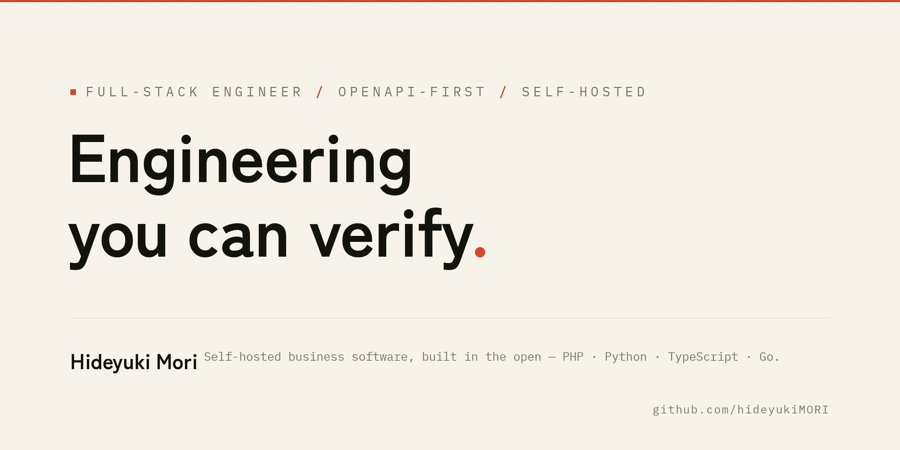
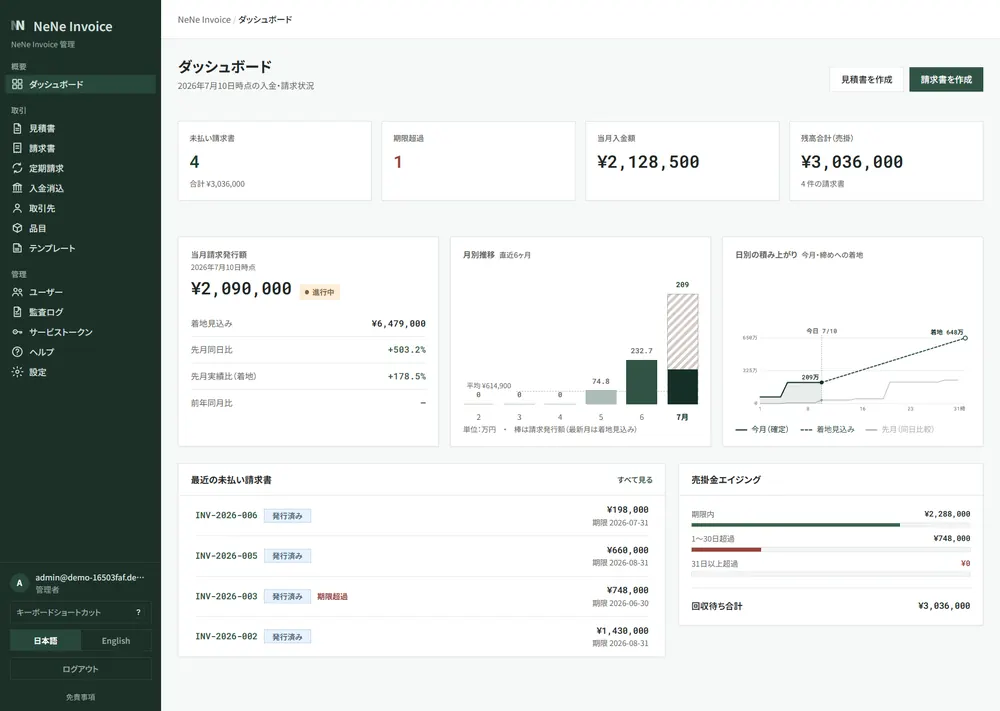
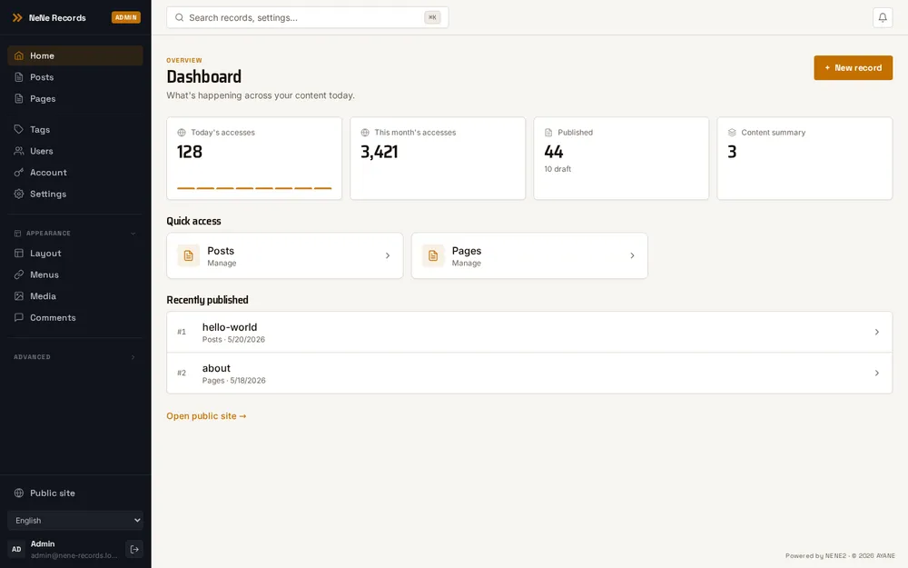
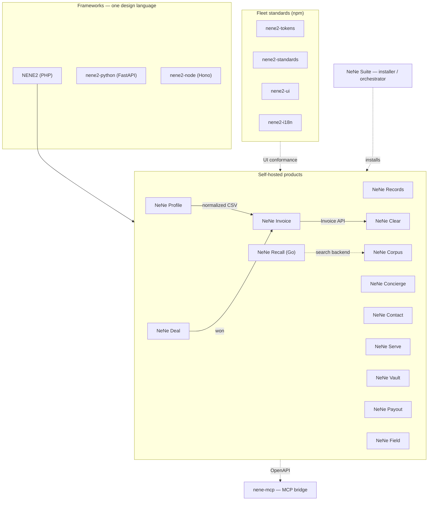

<picture>
  <source media="(prefers-color-scheme: dark)"  srcset="assets/hero-dark.webp">
  <source media="(prefers-color-scheme: light)" srcset="assets/hero-light.webp">
  
</picture>

# Hideyuki Mori

### Full-stack engineer. I build self-hosted business software in the open, and I put the proof next to every claim.

25 years of JavaScript and 20 years of PHP as a working engineer, from customer hearings through design, implementation, and operation. Since 2026 I have been building a fleet of **MIT-licensed, self-hosted business tools** end to end — one design language across PHP, Python, and TypeScript, **OpenAPI-first JSON APIs** that humans, CI, and AI agents can all navigate. Everything below is public and checkable: the code, the tests, the security work, and the architecture decisions.

<sub>日本語: フルスタックエンジニア（JavaScript 25年・PHP 20年）。要件ヒアリングから設計・実装・運用まで一人で完結させる働き方を長く続けてきました。2026年からは MIT ライセンスの自己ホスト型業務ツール群を OpenAPI ファーストで公開開発しています。このページの数字はすべてリンク先で検証できます。</sub>

---

## At a glance

Numbers are **measured, not claimed** — each links to where you can check it yourself. Snapshot: September 2026.

| | |
| --- | --- |
| **Live** | [Invoice demo](https://invoice.ayane.co.jp/demo/kensetsu) — a fresh disposable org per click, no signup · [nene-records.com](https://nene-records.com) — multi-tenant SaaS in production · [nene-corpus.com](https://nene-corpus.com) |
| **Scale** | **8,500+ merged PRs** across my own repositories ([verify](https://github.com/search?q=is%3Apr+is%3Amerged+author%3AhideyukiMORI+owner%3AhideyukiMORI&type=pullrequests)) · **38 public repos** |
| **Quality gates** | **PHPStan level 8** · `mypy --strict` · fleet-wide conformance linting · dependency audit in CI · **JWT fail-closed by default** |
| **Tests** | NeNe Records: **1,662 PHPUnit tests + 220 Playwright E2E** (`phpunit --list-tests`) · NeNe Invoice: 840 PHPUnit test methods |
| **MCP** | **140+ MCP tools across 8 product catalogs** — catalog-driven, typed boundaries (agents get tools, not raw DB access) |
| **Languages** | PHP 8.4 · Python 3.14 · TypeScript · Go — plus Rust, Java, Kotlin, C#, and C++ in [constraint-system experiments](#same-discipline-other-ecosystems) |

---

## How I work

- **Verifiable by construction.** Every product ships with its OpenAPI contract, its test suite, its security self-assessment, and ADRs explaining why. A reviewer should never have to take my word for it.
- **One design language, several runtimes.** Handler → UseCase → Repository, RFC 9457 Problem Details on every error surface, the same OpenAPI-shaped boundaries in PHP, Python, and Node. New team members and AI agents navigate without hidden magic.
- **AI-driven delivery, engineered for reproducibility.** I have used AI coding tools in production work since late 2023, and since January 2026 I run a systematic spec → implementation → adversarial-review workflow — first on a regional bank's core-system cloud migration, then across this fleet. The interesting part is not speed; it is that the process is written down, repeatable, and gated by CI.

---

## Touch it — live proof

Real products, not demo endpoints.

<p align="center">
  <a href="https://invoice.ayane.co.jp/demo/kensetsu"></a>
  &nbsp;
  <a href="https://nene-records.com"></a>
</p>

| | |
| --- | --- |
| **[NeNe Invoice — live demo](https://invoice.ayane.co.jp/demo/kensetsu)** | Every click provisions a fresh disposable environment. Quote → invoice → payment, qualified-invoice (適格請求書) PDF, three industry templates. No signup. |
| **[nene-records.com](https://nene-records.com)** | A production multi-tenant SaaS on this stack — sign up and get `your-slug.nene-records.com` (subdomain per org, auto TLS). |
| **[nene-corpus.com](https://nene-corpus.com)** | Knowledge chat with citations, running on the same framework. |

---

## The stack — pick your runtime

Same architecture · OpenAPI contract · RFC 9457 Problem Details · MCP-ready boundaries.

| Runtime | Stack | Latest | Start |
| --- | --- | --- | --- |
| **[NENE2](https://github.com/hideyukiMORI/NENE2)** | PHP 8.4 · OpenAPI author · MCP catalog · 264 howto guides | **v1.10.0** (release) / **v1.11.0** (Composer) | `composer require hideyukimori/nene2` |
| **[nene2-python](https://github.com/hideyukiMORI/nene2-python)** | FastAPI · `mypy --strict` · Pydantic v2 · 282 field trials | [v1.8.164](https://github.com/hideyukiMORI/nene2-python/releases) | `uv add nene2-python` |
| **[nene2-node](https://github.com/hideyukiMORI/nene2-node)** | Hono · TypeScript strict | [v0.3.0](https://github.com/hideyukiMORI/nene2-node/releases) | `npm i @hideyukimori/nene2-framework` |
| **[NeNe](https://github.com/hideyukiMORI/NeNe)** | PHP 8.4 · Smarty · a legacy framework renovated in the open | [v0.3.0](https://github.com/hideyukiMORI/NeNe/releases) | [Demo](https://nene-php.com/) · `composer require` |

### Fleet-wide frontend standards (npm)

A versioned convention layer every product UI is held to — maintained in [nene2-fleet-tooling](https://github.com/hideyukiMORI/nene2-fleet-tooling).

| Package | Role | Latest |
| --- | --- | --- |
| **[`@hideyukimori/nene2-tokens`](https://www.npmjs.com/package/@hideyukimori/nene2-tokens)** | Design tokens (color / type / spacing), one source of truth | v1.3.0 |
| **[`@hideyukimori/nene2-standards`](https://www.npmjs.com/package/@hideyukimori/nene2-standards)** | Fleet frontend conventions + conformance rules | v2.4.0 |
| **[`@hideyukimori/nene2-ui`](https://www.npmjs.com/package/@hideyukimori/nene2-ui)** | Shared React components built on the tokens | v0.21.0 |
| **[`@hideyukimori/nene2-i18n`](https://www.npmjs.com/package/@hideyukimori/nene2-i18n)** | Shared i18n contract (typed authority language) | v0.3.2 |

---

## Products

MIT · self-hosted · OpenAPI-first · MCP for ops. Separate repos, separate databases, HTTP contracts only — install what you need.

### Content, knowledge & conversion

| Product | One line | Status |
| --- | --- | --- |
| **[NeNe Records](https://github.com/hideyukiMORI/nene-records)** | Headless CMS — typed entities, React admin, **70 MCP tools**, multi-tenant JWT | **Production SaaS** · [v0.5.3](https://github.com/hideyukiMORI/nene-records/releases) · [nene-records.com](https://nene-records.com) |
| **[NeNe Corpus](https://github.com/hideyukiMORI/nene-corpus)** | Knowledge chat with citations — PDF/CSV ingest, embed widget, shared-hosting ZIP | Live · [nene-corpus.com](https://nene-corpus.com) |
| **[NeNe Recall](https://github.com/hideyukiMORI/nene-recall)** | Hybrid search & retrieval service in **Go** — PostgreSQL + pgvector, local embeddings, no paid APIs; drop-in backend for Corpus | Active development |
| **[NeNe Concierge](https://github.com/hideyukiMORI/nene-concierge)** | Visual chat scenarios — embed on product pages; actions (email / Slack / Chatwork), **27 MCP tools** | Engine + admin + widget |
| **[NeNe Contact](https://github.com/hideyukiMORI/nene-contact)** | Embeddable contact forms — one-line embed, email / Slack / Chatwork routing, inbox | In production on [ayane.co.jp](https://ayane.co.jp/) |
| **[NeNe Serve](https://github.com/hideyukiMORI/nene-serve)** | Self-hosted ad serving — placements, weights and caps, metrics with CSV export, six locales | Working |

### Japan SMB back-office — sibling apps, one stack

```
NeNe Profile          NeNe Invoice          NeNe Clear           NeNe Vault
(bank CSV normalize)  (quote · invoice ·     (reconcile ·         (received docs ·
                       payment SoR)          dunning)              電子帳簿保存法)
        │                     ▲                     ▲
        └──── normalized CSV ─┴──── Invoice API ────┘
                              ▲
        NeNe Deal ── won ─────┘        NeNe Payout (pay vendors by card)   NeNe Field (daily reports)
```

| Product | Domain | Status |
| --- | --- | --- |
| **[NeNe Invoice](https://github.com/hideyukiMORI/nene-invoice)** | 見積・請求・入金 — 適格請求書 PDF, multi-tenant admin | **[v1.0.0](https://github.com/hideyukiMORI/nene-invoice/releases)** · **[live demo](https://invoice.ayane.co.jp/demo/kensetsu)** |
| **[NeNe Clear](https://github.com/hideyukiMORI/nene-clear)** | 入金消込・督促 — consumes Invoice `/api/*`, not a billing app | Working · 10 MCP tools |
| **[NeNe Vault](https://github.com/hideyukiMORI/nene-vault)** | 受領文書アーカイブ — search, retention, audit (電子帳簿保存法) | Working · `docker compose up` → `:8600` |
| **[NeNe Profile](https://github.com/hideyukiMORI/nene-profile)** | Bank-CSV column mapping → standard transaction export | Working |
| **[NeNe Deal](https://github.com/hideyukiMORI/nene-deal)** | Ultra-light B2B pipeline — kanban, forecast, won → Invoice handoff | Working · CI |
| **[NeNe Payout](https://github.com/hideyukiMORI/nene-payout)** | Pay received vendor invoices by credit card, data stays on your server; embeddable widget | Working |
| **[NeNe Field](https://github.com/hideyukiMORI/nene-field)** | Daily reports from field workers' phones; review, approve, export | Working |

**Not one monolith.** Invoice issues bills; Clear clears deposits; Profile normalizes CSV; Vault archives received PDFs; Payout pays the other direction. Each repo's ADR 0009 documents its boundary.

### Install, integrate, tool

| | |
| --- | --- |
| **[NeNe Suite](https://github.com/hideyukiMORI/nene-suite)** | Multi-app installer + orchestrator — catalog-driven install wizard, apex login shell, audit trail on every mutation. No domain logic of its own. |
| **[nene2-js](https://github.com/hideyukiMORI/nene2-js)** | Typed HTTP client `@hideyukimori/nene2-client` · multi-backend verify · [v1.4.0](https://github.com/hideyukiMORI/nene2-js/releases) |
| **[nene-mcp](https://github.com/hideyukiMORI/nene-mcp)** | stdio MCP bridge → any OpenAPI-backed HTTP API · [v0.1.8](https://github.com/hideyukiMORI/nene-mcp/releases) |
| **[NENE2-examples](https://github.com/hideyukiMORI/NENE2-examples)** | **120+ runnable field-trial apps** — one pattern per howto |
| **[xi-tools](https://github.com/hideyukiMORI/xi-tools)** | **Rust** tools for a many-repo workflow — `scopegrep` (grep that reports *where in the structure* a hit lives), `fleet-top` (dozens of repos on one screen) |

### How the pieces fit



---

## Same discipline, other ecosystems

The fleet above is PHP / Python / TypeScript. These repos take one idea from it — **every meaning has exactly one canonical implementation path, and the type system, build graph, static analysis, and CI enforce that, not memory** — and apply it in ecosystems where I am deliberately a learner rather than a veteran.

| Repo | Ecosystem | What it is |
| --- | --- | --- |
| **[nene-recall](https://github.com/hideyukiMORI/nene-recall)** | Go · PostgreSQL · pgvector | Hybrid vector + lexical retrieval API, fully local |
| **[xi-tools](https://github.com/hideyukiMORI/xi-tools)** | Rust | Developer tools with measured performance notes (REST in series vs. parallel vs. GraphQL for 60 repos) |
| **[nene-clock](https://github.com/hideyukiMORI/nene-clock)** | Java 21 · Swing | A small desktop clock whose point is the constraint system around it |
| **[NENE-PIXEL](https://github.com/hideyukiMORI/NENE-PIXEL)** | Kotlin · Android | Pixel drawing tool with an architecture constitution and command model |
| **[NeNeCommander](https://github.com/hideyukiMORI/NeNeCommander)** | C# · .NET 10 · WinUI 3 | Keyboard-first dual-pane file manager; typed Windows / UNC / WSL paths, fail-closed file operations |
| **[nene-loupe](https://github.com/hideyukiMORI/nene-loupe)** | C++23 · plain Win32 | Frameless 8× screen loupe and colour picker; the first of these with a shipped [portable release](https://github.com/hideyukiMORI/nene-loupe/releases) (v0.2.0, ZIP + SHA256SUMS) — and a written list of what C++ could not be made to refuse |

Each one starts from a project charter, an architecture constitution, and a test strategy before the first feature — the documents are in the repos.

---

## Security & quality practice

Stated precisely, because a public profile is read by people who will check.

- **Security testing is authorized, maintainer-run self-assessment** — black-box live attack simulation, red-team passes, regression + reproduction harnesses, run against isolated environments (never against production). **This is not a third-party penetration test.** Deepest coverage: **NENE2**, **NeNe Invoice** (multiple rounds + red-team + fix PRs), **NeNe Clear**.
- **JWT is fail-closed by default, fleet-wide** — org isolation denies on any resolver ambiguity rather than falling open.
- **Static analysis as a gate** — PHPStan **level 8** on the PHP fleet, `mypy --strict` on nene2-python, conformance linting across products, dependency audits (`npm audit` / `composer audit`) in CI.
- **RFC 9457 Problem Details** for every error surface; **MCP boundaries are catalog-driven**, so agents get typed tools, not raw DB access.

---

## Representative work

Three repos that show the range — framework design, production-grade product, and cross-language parity.

### [NENE2](https://github.com/hideyukiMORI/NENE2) — framework design & API architecture
A PHP 8.4 micro-framework with a full OpenAPI + MCP catalog, PHPStan level 8, and **264 task-focused howto guides**.
Look at: [`docs/adr/`](https://github.com/hideyukiMORI/NENE2/tree/main/docs/adr) (why decisions were made) · [`src/`](https://github.com/hideyukiMORI/NENE2/tree/main/src) (clean HTTP / DI / middleware) · [`docs/howto/`](https://github.com/hideyukiMORI/NENE2/tree/main/docs/howto)

### [NeNe Invoice](https://github.com/hideyukiMORI/nene-invoice) — production product quality
Self-hosted quote-to-cash with qualified-invoice PDF (日本適格請求書), multi-tenant JWT, Docker + shared-hosting dual path, and the fleet's thickest security self-assessment. Released as **v1.0.0** in August 2026. **[Try the live demo](https://invoice.ayane.co.jp/demo/kensetsu)** — every click provisions a fresh disposable environment.
Look at: [`docs/security/`](https://github.com/hideyukiMORI/nene-invoice/tree/main/docs/security) · [`docs/openapi/openapi.yaml`](https://github.com/hideyukiMORI/nene-invoice/blob/main/docs/openapi/openapi.yaml) · [`src/`](https://github.com/hideyukiMORI/nene-invoice/tree/main/src)

### [nene2-python](https://github.com/hideyukiMORI/nene2-python) — cross-language, type-safe, tested
A FastAPI port of the same architecture: `mypy --strict`, UseCase/Repository separation with zero DB in domain tests, **282 documented field trials**.
Look at: [`src/nene2/`](https://github.com/hideyukiMORI/nene2-python/tree/main/src/nene2) · [`tests/`](https://github.com/hideyukiMORI/nene2-python/tree/main/tests) · [`docs/field-trials/INDEX.md`](https://github.com/hideyukiMORI/nene2-python/blob/main/docs/field-trials/INDEX.md)

---

## Articles

I write about what actually broke and what fixed it — [DEV](https://dev.to/hideyukimori) · [Zenn](https://zenn.dev/xioncc) · [Qiita](https://qiita.com/xioncc).

**Featured**

*English*
- [I built a tiny PHP framework for AI-readable business APIs](https://dev.to/hideyukimori/i-built-a-tiny-php-framework-for-ai-readable-business-apis-48eo) — DEV
- [MCP should not mean letting AI touch your database](https://dev.to/hideyukimori/mcp-should-not-mean-letting-ai-touch-your-database-57p1) — DEV
- [A todo.txt shared by a human and AI agents](https://dev.to/hideyukimori/a-todotxt-shared-by-a-human-and-ai-agents-why-plain-text-beat-a-saas-board-for-my-workflow-5dbh) — DEV

*日本語*
- [テストが全部緑でも壊せる｜リリース前アドバーサリアルレビューを常設する](https://zenn.dev/xioncc/articles/349a739826288b) — Zenn
- [コンテキストが溢れる AI 協働を multi-session で回す｜指揮×担当を指示書と報告書で受け渡す](https://zenn.dev/xioncc/articles/4445ac86600d28) — Zenn
- [レガシー PHP フレームワークの改修（NeNe）](https://zenn.dev/xioncc/articles/a2709df3e0de3b) — Zenn

**Latest** <!-- auto-updated from the nene-articles pipeline · do NOT hand-edit between the markers below -->
<!-- ARTICLES:START -->
- [Two AI Agents Shared a Todo File and a Line Vanished](https://dev.to/hideyukimori/two-ai-agents-shared-a-todo-file-and-a-line-vanished-22jd) — DEV (en) · 2026-08-08
- [適用ゼロで codemod の非冪等バグを見つけた──撃つ前の机上 dry-run](https://zenn.dev/xioncc/articles/codemod-desk-check-idempotence) — Zenn (ja) · 2026-08-07
- [target="_blank"がハイドレーション後だけ消える｜SSR/SPA二重sanitizerの罠](https://qiita.com/xioncc/items/32c9220145e116263023) — Qiita (ja) · 2026-08-06
- [AI への作業指示書は4日で腐る──着手前の再実測が空撃ちを防いだ](https://zenn.dev/xioncc/articles/stale-orders-subordinate-verifies) — Zenn (ja) · 2026-08-05
- [緑の PR を 11 秒差でマージしたら main が赤になった話｜PR CI は統合後の main を検証しない](https://qiita.com/xioncc/items/d26f17c566a6139f4aff) — Qiita (ja) · 2026-08-05
<!-- ARTICLES:END -->

<sub>Featured = hand-picked · Latest = newest 5 (max 2 per platform).</sub>

---

**Contact** — [ayane.co.jp](https://ayane.co.jp/) · or open an issue on any repo above.
